# Playbook de Despliegue Técnico: OpenLDAP

> Entorno documentado: Debian 13 en VirtualBox, red NAT sin DHCP y directorio LDAP para `planetafp.local`.

## A. Ficha técnica y prerrequisitos

| Elemento | Configuración |
|---|---|
| Plataforma de virtualización | VirtualBox |
| Red | NAT, sin DHCP |
| Sistema operativo | Debian 13 |
| Interfaz de red | `enp0s3` |
| Dirección IPv4 estática | `20.0.0.5/24` |
| Puerta de enlace | `20.0.0.1` |
| DNS | `8.8.8.8`, `8.8.4.4` |
| FQDN LDAP | `ldapserver.planetafp.local` |
| Alias local | `ldapserver` |
| Dominio del directorio (DIT) | `planetafp.local` (`dc=planetafp,dc=local`) |
| Organización | `planetafp` |
| Paquetes | `slapd`, `ldap-utils` |

LDAP (*Lightweight Directory Access Protocol*) es un protocolo para consultar y administrar un directorio jerárquico de información, por ejemplo usuarios, grupos y recursos de una organización.

- `slapd`: demonio de OpenLDAP que almacena y publica el directorio.
- `ldap-utils`: herramientas de administración por terminal, entre ellas `ldapsearch`, `ldapadd` y `ldapmodify`.
- `libldap`: biblioteca cliente LDAP utilizada por aplicaciones y utilidades que se conectan al directorio.

### Prerrequisitos

- Máquina virtual Debian 13 instalada en VirtualBox.
- Adaptador de red configurado como NAT, sin DHCP.
- Cuenta con privilegios `sudo`.
- Acceso a repositorios APT.

## B. Procedimiento de despliegue paso a paso

### Paso 1. Configuración de red estática

Crear o editar el fichero `/etc/netplan/01-netcfg.yaml`:

```yaml
network:
  version: 2
  renderer: networkd
  ethernets:
    enp0s3:
      dhcp4: no
      addresses:
        - 20.0.0.5/24
      routes:
        - to: default
          via: 20.0.0.1
      nameservers:
        addresses:
          - 8.8.8.8
          - 8.8.4.4
```

Aplicar y comprobar la configuración:

```bash
sudo netplan generate
sudo netplan apply
ip addr show enp0s3
ip route
```

El fichero clásico `/etc/network/interfaces` no debe tener una configuración activa que entre en conflicto con Netplan para `enp0s3`.

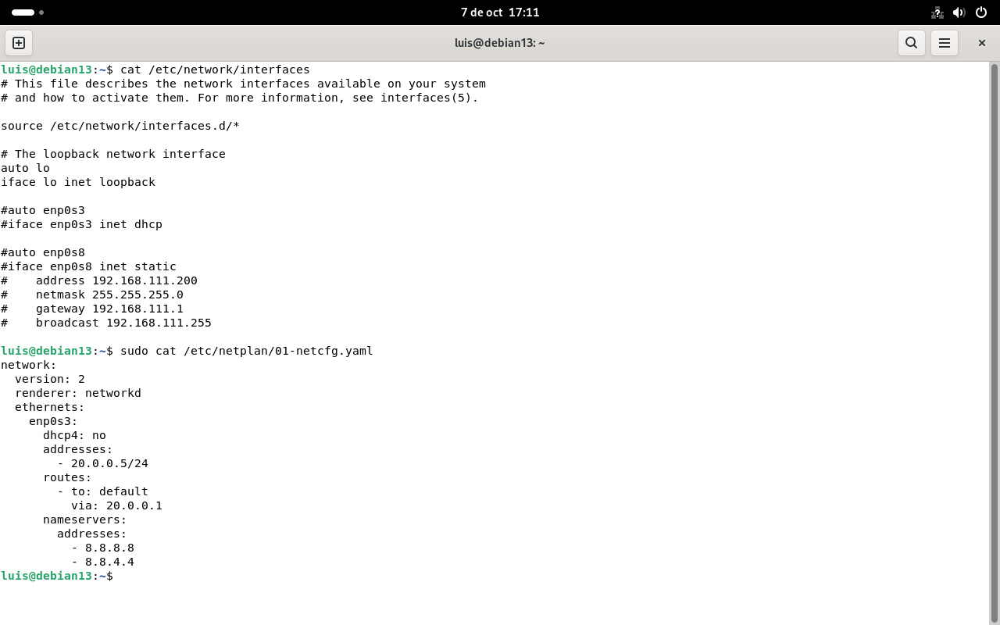

### Paso 2. Resolución de nombres local

Añadir a `/etc/hosts` la asociación entre IP, FQDN y alias:

```text
20.0.0.5    ldapserver.planetafp.local    ldapserver
```

Comprobar la resolución local:

```bash
getent hosts ldapserver
getent hosts ldapserver.planetafp.local
```

Esta entrada permite que el servidor se resuelva mediante nombre aunque no exista un servidor DNS autoritativo para `planetafp.local`.

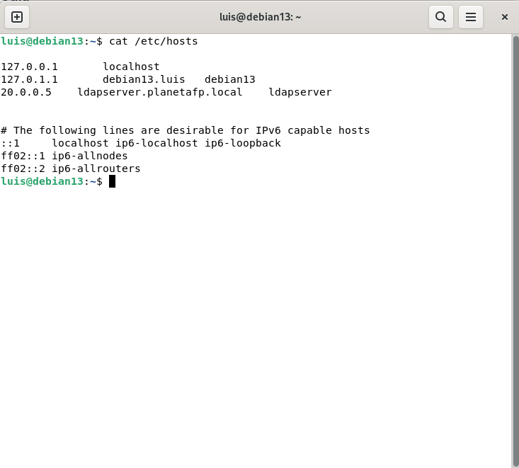

### Paso 3. Instalación de software

Actualizar el índice de paquetes e instalar los componentes requeridos:

```bash
sudo apt update
sudo apt install -y slapd ldap-utils
```

El asistente de `slapd` puede aparecer durante la instalación. Si no se configura entonces, se completa mediante `dpkg-reconfigure`.

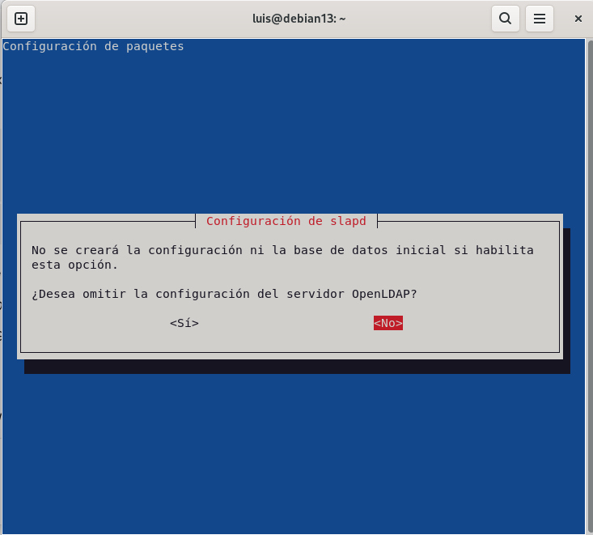

### Paso 4. Reconfiguración de slapd

Ejecutar el asistente:

```bash
sudo dpkg-reconfigure slapd
```

Respuestas utilizadas:

| Pregunta | Respuesta |
|---|---|
| ¿Desea omitir la configuración del servidor OpenLDAP? | **No** |
| Nombre de dominio DNS | `planetafp.local` |
| Nombre de la organización | `planetafp` |
| Contraseña del administrador | Definir y confirmar una contraseña robusta |
| ¿Desea borrar la base de datos al purgar `slapd`? | **No** |
| ¿Desea mover la base de datos antigua? | **Sí**, si el asistente detecta datos anteriores |

El dominio crea el DN base `dc=planetafp,dc=local`. El DN de administración utilizado es `cn=admin,dc=planetafp,dc=local`.


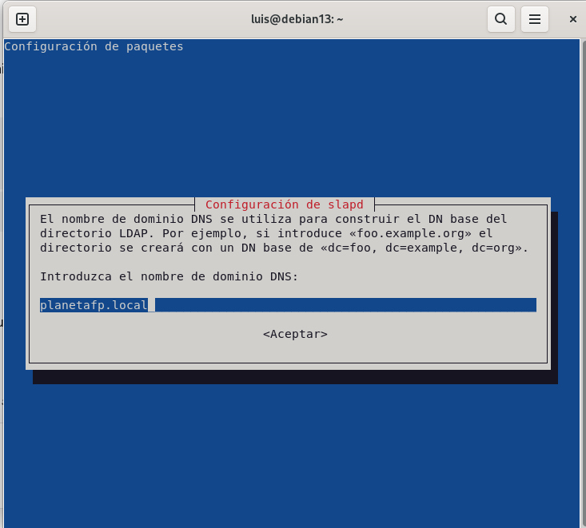

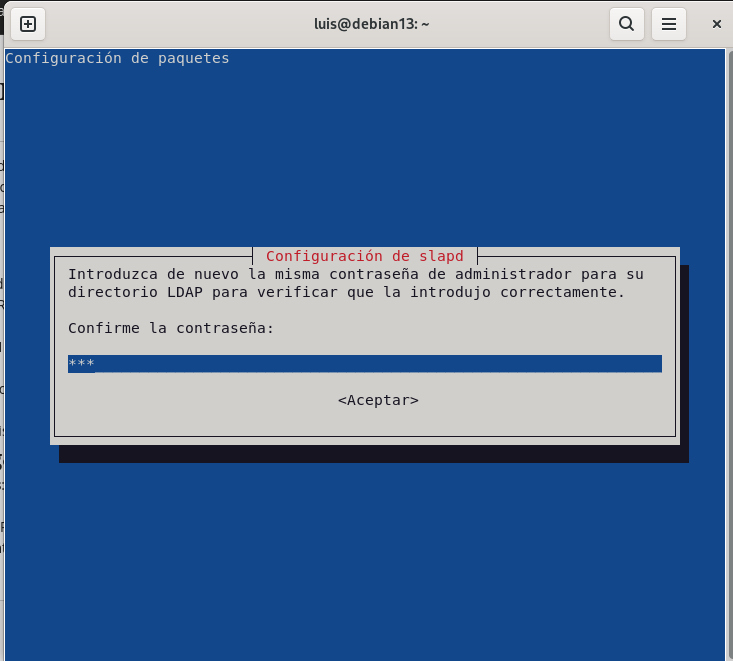

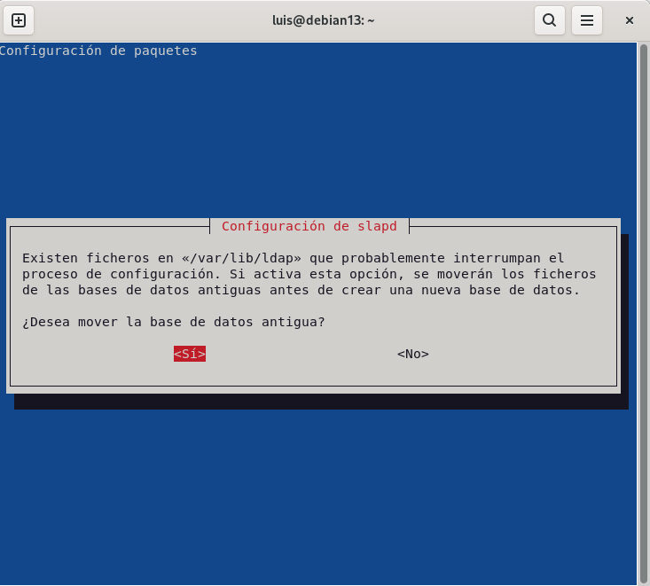

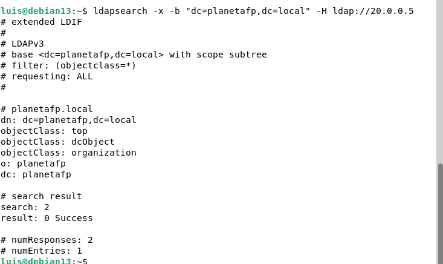

## C. Verificación y comprobación

Comprobar que el demonio LDAP está activo y habilitado:

```bash
sudo systemctl status slapd
sudo systemctl is-enabled slapd
```

El resultado esperado es `active (running)` y el servicio habilitado para iniciar con el sistema.

Consultar la entrada raíz del DIT:

```bash
ldapsearch -x -H ldap://20.0.0.5 \
  -b "dc=planetafp,dc=local" \
  -s base "(objectClass=*)"
```

La consulta debe devolver la entrada `dc=planetafp,dc=local` con las clases `top`, `dcObject` y `organization`, además de `o: planetafp` y `dc: planetafp`.

Consultar los esquemas locales cargados, usando el socket local y autenticación EXTERNAL:

```bash
sudo ldapsearch -Y EXTERNAL -H ldapi:/// \
  -b "cn=schema,cn=config" -LLL dn cn
```

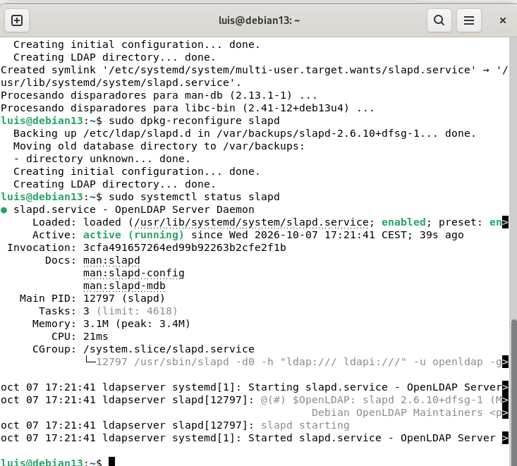

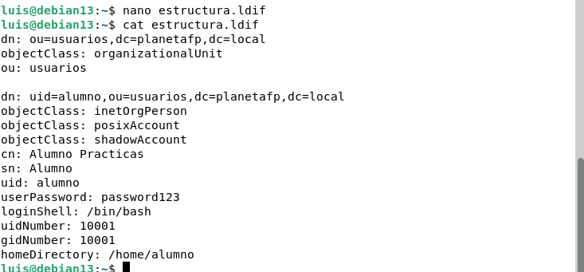

## D. Población del directorio y operaciones básicas

### Fichero LDIF de prueba

El fichero [`ldif/estructura.ldif`](ldif/estructura.ldif) crea la unidad organizativa `usuarios` y el usuario de laboratorio `alumno`:

```ldif
dn: ou=usuarios,dc=planetafp,dc=local
objectClass: organizationalUnit
ou: usuarios

dn: uid=alumno,ou=usuarios,dc=planetafp,dc=local
objectClass: inetOrgPerson
objectClass: posixAccount
objectClass: shadowAccount
cn: Alumno Practicas
sn: Alumno
uid: alumno
userPassword: password123
loginShell: /bin/bash
uidNumber: 10001
gidNumber: 10001
homeDirectory: /home/alumno
```

> La contraseña `password123` se usa solo para laboratorio. En producción se debe generar un hash con `slappasswd`, activar TLS y definir una política de contraseñas.

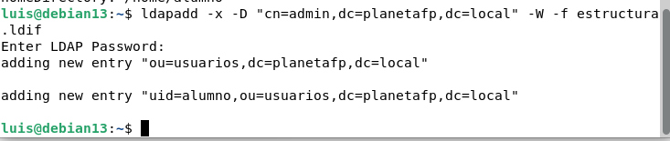

### Inserción con ldapadd

Cargar el fichero con autenticación simple y bind administrativo:

```bash
ldapadd -x \
  -D "cn=admin,dc=planetafp,dc=local" \
  -W \
  -f ldif/estructura.ldif
```

- `-x`: usa autenticación simple.
- `-D`: indica el DN con el que se realiza el bind autenticado.
- `-W`: solicita la contraseña de forma interactiva.
- `-f`: indica el fichero LDIF a cargar.

La salida correcta informa de la creación de `ou=usuarios,dc=planetafp,dc=local` y `uid=alumno,ou=usuarios,dc=planetafp,dc=local`.

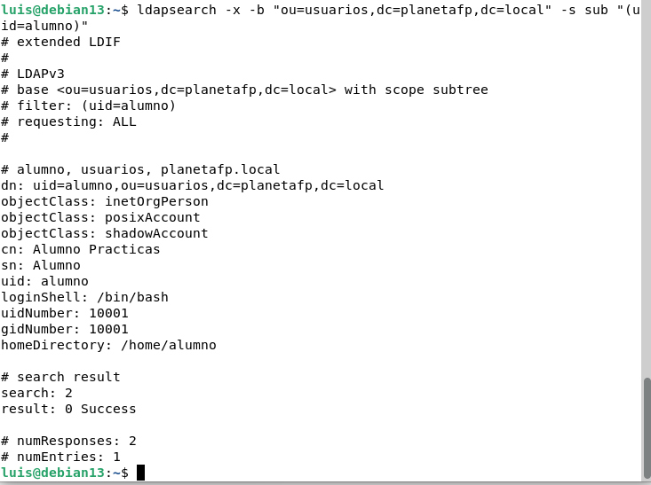

### Consulta con ldapsearch

Buscar el usuario dentro del subárbol de la unidad organizativa:

```bash
ldapsearch -x \
  -H ldap://20.0.0.5 \
  -b "ou=usuarios,dc=planetafp,dc=local" \
  -s sub \
  "(uid=alumno)"
```

- `-b`: define la base de búsqueda.
- `-s sub`: limita la consulta al subárbol de la base indicada.
- `"(uid=alumno)"`: filtra por el atributo `uid`.

La salida esperada debe incluir el DN del usuario y atributos como `loginShell`, `uidNumber`, `gidNumber` y `homeDirectory`.

> No se ha incluido una captura adicional de esta consulta final, pero el comando y la salida esperada quedan documentados para permitir su reproducción.

## E. Control de errores y troubleshooting

| Incidencia | Síntoma | Diagnóstico | Solución |
|---|---|---|---|
| Error de sintaxis LDIF | `ldapadd` devuelve `Invalid syntax (21)` o no carga una entrada | Revisar DN, atributos, clases de objeto y las líneas vacías entre entradas | Validar sin aplicar cambios con `ldapadd -n -x -D "cn=admin,dc=planetafp,dc=local" -W -f ldif/estructura.ldif`; corregir el fichero y repetir sin `-n` |
| Fallo de resolución de nombres | `ldapserver` no resuelve o no conecta usando el FQDN | Ejecutar `getent hosts ldapserver` y revisar `/etc/hosts` | Añadir o corregir `20.0.0.5 ldapserver.planetafp.local ldapserver`; revisar que no haya IP duplicadas ni erratas |
| Bind no autorizado | `ldap_bind: Invalid credentials (49)` | El DN administrativo o la contraseña introducida no son válidos | Comprobar `cn=admin,dc=planetafp,dc=local`; si la contraseña se desconoce, ejecutar `sudo dpkg-reconfigure slapd`; introducirla con `-W` |
| Servidor no disponible | `Can't contact LDAP server (-1)` | El servicio está detenido, no escucha o existe un fallo de red | Consultar `sudo systemctl status slapd` y `sudo journalctl -u slapd -b`; reiniciar con `sudo systemctl restart slapd`; comprobar IP, ruta y conectividad |

### Comprobaciones finales

```bash
sudo systemctl status slapd
getent hosts ldapserver
ldapsearch -x -H ldap://ldapserver \
  -b "dc=planetafp,dc=local" -s sub "(uid=alumno)"
```

La práctica se considera validada cuando `slapd` está activo, `ldapserver` resuelve a `20.0.0.5`, existe la base `dc=planetafp,dc=local` y la consulta devuelve el usuario `alumno`.
